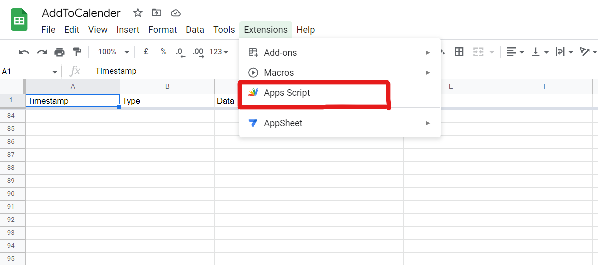
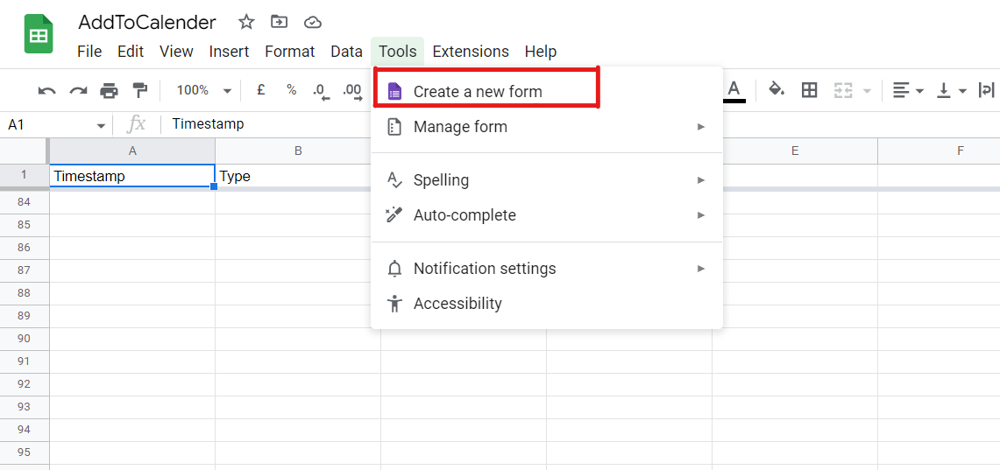
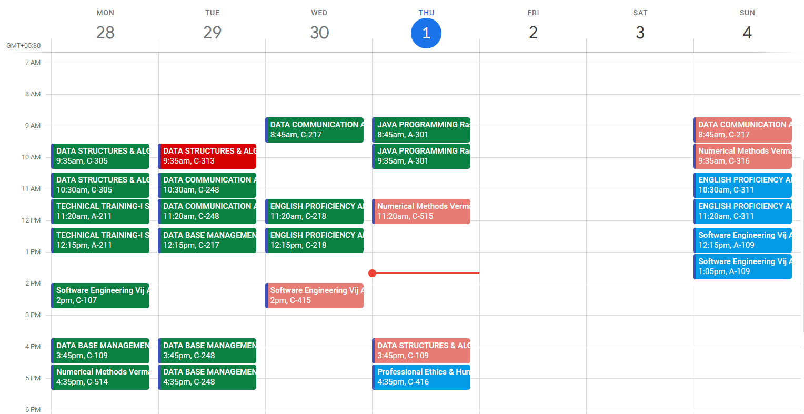

# GU iCloud to Google Calendar Automation

Show iCloud calendar classes in Google Calendar

## Table of Contents

- [About](#about)
- [Getting Started](#getting_started)
- [Installing](#installing)
- [Usage](#usage)

## About
This is a project to automate the process of importing iCloud calendar events into Google Calendar. The project is written in Python and uses the Selenium library to automate the process of logging into iCloud and Submitting data in Google sheet. The project is currently working but there is still a lot of room for improvement.\
If you have any better ideas or suggestions, please feel free to pull request or contact me.

## Getting Started
These instructions will get you a copy of the project up and running on your local machine for development and testing purposes.\
Requirements:\

Python 3

## Installing
Download the project and install the requirements using the following command:
Open the directory in terminal and run the following command:

```git clone https://github.com/fjueic/iCloud-to-Google-Calender.git```

Create a virtual environment and install the requirements using the following command:

```py -m venv venv```

```venv\Scripts\activate.bat```

```pip install -r requirements.txt```


Update user id, password and Google form link(discussed below) in the  [cerdential.txt](cerdential.txt) file.

Get the [calendar link](https://yabdab.zendesk.com/hc/en-us/articles/205945926-Find-Google-Calendar-ID) of the calendar you want to import the events to.
Paste the link in the [Appscript.gs](calendar.txt) at [line 5](AppScript.gs#L5).

Open your [google drive](https://drive.google.com/drive/my-drive) and create a new Google sheet.

Copy the [sheet id](https://docs.meiro.io/books/meiro-integrations/page/where-can-i-find-the-sheet-id-of-google-spreadsheet-file) and paste it in the [Appscript.gs](AppScript.gs) at [line 1](AppScript.gs#L1).

Create a new [Google App Script project](img/Extensions.png) and copy the [Appscript.gs](AppScript.gs) code into the project.


Save the app script project and grant the required permissions.
Google will warn you that the app script project is not verified. Click on the advanced option and click on the link to continue.

Now, open sheet and create new google form using the following steps:

The form should look like this: [Form](https://docs.google.com/forms/d/e/1FAIpQLSe90HPFPm96RrGnEAOaQLp9Tgzo65DoHv0Xcb5qzvbPwkQSAA/viewform?usp=share_link)

**PROGRAM IS CASE SENSITIVE TO THE FORM FIELDS. PLEASE DO NOT CHANGE THE FORM FIELDS.**


## Usage
Run the following command to start the program:
```python main.py```
If the program runs successfully, you will see the following output in your Google calendar:


You may set up a Windows Task Scheduler to run the program at a specific interval.

Refer to the following link for more information: [Windows Task Scheduler](https://www.windowscentral.com/how-create-automated-task-using-task-scheduler-windows-10)
