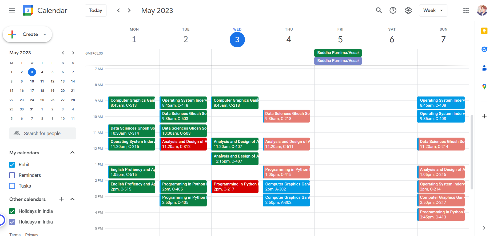

<br/>
<p align="center">
  <h3 align="center">Sync icloud google calendar</h3>

  <p align="center">
    <a href="https://github.com/fjueic/iCloud-to-Google-Calender/issues">Report Bug</a>
    .
    <a href="https://github.com/fjueic/iCloud-to-Google-Calender/issues">Request Feature</a>
  </p>
</p>

      

## Table Of Contents

* [About the Project](#about-the-project)
* [Built With](#built-with)
* [Getting Started](#getting-started)
  * [Prerequisites](#prerequisites)
  * [Installation](#installation)
* [Usage](#usage)
* [Roadmap](#roadmap)
* [Contributing](#contributing)
* [License](#license)


## About The Project



This project aims to provide a more efficient solution for timetable management at Galgotias University by showcasing the university's timetable on Google Calendar. While GU iCloud is one of the most famous timetable management sites, it has its downsides, such as being time-consuming and frustrating for users.

We have come up with a better solution. Using Selenium, we collect raw data from GU iCloud and convert it into a CSV file. We then upload this data into Google Sheets, where an app script is run to showcase the timetable on Google Calendar. 

## Built With

* [Python](https://www.python.org/)

## Getting Started

We used some hard coded paths due to which this project will only work for Windows.

### Prerequisites

   - Python3
     - You download python [here](https://www.python.org/downloads/).
   - Chrome
     - You download chrome [here](https://www.google.com/chrome/).

### Installation

1. Setup sheet and appscript:-
   - Open [Google Appscript](https://script.google.com/home/start) and create a new project.
   - Copy the content from [setup.gs](./setup.gs) and run setup function. In case of failure, just try re runnning it.

   Expected result:-
    
   - Save the Form URL from the log as you will be prompted to enter it later.
   - Go to your [Google Drive](https://drive.google.com/) and open iCloud-form, present in iCloud-config folder, and click on responses. You will find a Link to Sheet option on top.
   - Link the iCloud-data sheet, present in the same folder as iCloud-config.
   - Open iCloud-data sheet, and click on Extensions > Appscript.
   - Paste all the code from [Appscript.gs](./Appscript.gs) to the Appscript and save it.
   - Set Select event type to "on form submit".
   - Set Choose which function to run to "main".
2. Setup on your PC.
   - Install using pip:-
     ```sh
     pip install icloudtogcal && icloud_run_script
     ```
   - Wait for dependencies to be installed, and then you will be prompted to enter the ID, password and form URL. Enter the URL you saved earlier.

## Usage

   -  Entry point will be icloud_run_script. You can run it using:-
   ```sh
   icloud_run_script
   ```
   - For running script in background, after regular intervals, you can use Windows Task Scheduler. You can find a tutorial [here](https://www.youtube.com/watch?v=n2Cr_YRQk7o).
   - For updating ID, password or form URL, you can use:-
   ```sh
    icloud_config
   ```
   - You can find the executable for updaing ID, password or form URL in desktop folder.

## Roadmap

See the [open issues](https://github.com/fjueic/iCloud-to-Google-Calender/issues) for a list of proposed features (and known issues).

## Contributing

Contributions are what make the open source community such an amazing place to be learn, inspire, and create. Any contributions you make are **greatly appreciated**.
* If you have suggestions for adding or removing projects, feel free to [open an issue](https://github.com/fjueic/iCloud-to-Google-Calender/issues/new) to discuss it, or directly create a pull request after you edit the *README.md* file with necessary changes.
* Please make sure you check your spelling and grammar.
* Create individual PR for each suggestion.
### Creating A Pull Request

1. Fork the Project
2. Create your Feature Branch (`git checkout -b feature/AmazingFeature`)
3. Commit your Changes (`git commit -m 'Add some AmazingFeature'`)
4. Push to the Branch (`git push origin feature/AmazingFeature`)
5. Open a Pull Request

## License

Distributed under the MIT License. See [LICENSE](https://github.com/fjueic/iCloud-to-Google-Calender/blob/main/LICENSE) for more information.
